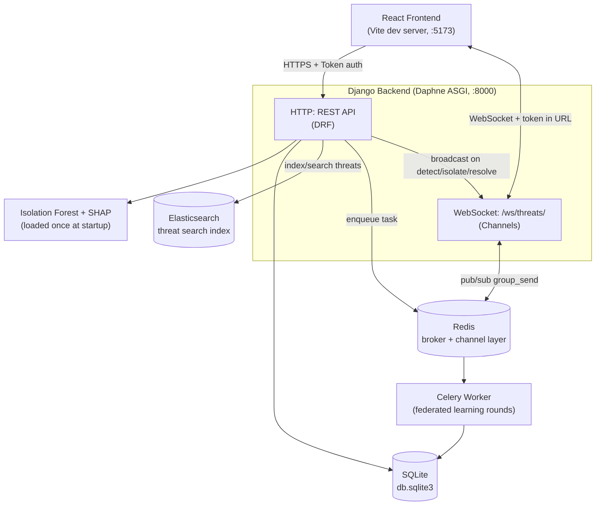

# Architecture

## System overview

## Why each piece exists

| Concern | Choice | Why |
|---|---|---|
| Anomaly detection | Isolation Forest (scikit-learn) | Unsupervised - doesn't need labeled attack data to train, well-suited to network traffic where "normal" vastly outnumbers "attack" |
| Explainability | SHAP `TreeExplainer` | Isolation Forest is a tree ensemble; `TreeExplainer` is fast and exact for tree models, confirmed compatible via a standalone test before wiring into the live API |
| Federated learning | Custom ensemble/weighted-voting (**not** FedAvg) | FedAvg averages neural network *weights* across clients - there's no clean mathematical way to average tree *structures* the way you average weight matrices. Each base trains independently; predictions are combined via F1-weighted voting at inference time instead |
| Background tasks | Celery + Redis | Training a federated round (3 models) takes real time - doing it synchronously inside an HTTP request would time out or freeze the UI. Celery lets `/run-round/` return instantly (`202 Accepted`) while training happens in a separate worker process |
| Real-time updates | Django Channels + Daphne | New threats need to appear on the Threats page instantly, not on a polling interval. Channels adds WebSocket support on top of the same Django app; Daphne (added first to `INSTALLED_APPS`) makes `runserver` itself ASGI-capable, so no separate server process is needed |
| Search / log storage | Elasticsearch | The Django ORM (`/api/threats/`) is fine for structured queries, but free-text + filtered search (e.g. "find anything mentioning this IP") is what Elasticsearch is actually built for. Kept as a genuinely separate data path from the database, not a cache in front of it |
| Auth | DRF Token Authentication | Simple, stateless, works identically for the REST API and (via a query-param workaround) the WebSocket handshake, which can't carry custom headers |
| Containerization | Docker Compose, with healthchecks | `depends_on` alone only waits for a container to *start*, not for the service inside it to be *ready* (Elasticsearch in particular takes 20-30+ seconds). Real healthchecks + `condition: service_healthy` make a cold `docker compose up` reliable on the first try |

## Backend app breakdown (`backend/apps/`)

- **`core`** — the 5 shared models (`MilitaryBase`, `NetworkTraffic`,
  `ThreatDetection`, `FederatedModelRound`, `ClientMetrics`) and their
  standard REST CRUD endpoints (`ModelViewSet` + `DefaultRouter`). Nothing
  else in the project defines its own models - everything else references
  these.
- **`anomaly_detection`** — the actual ML: `engine.py` wraps
  `IsolationForest` + `StandardScaler` + the SHAP `TreeExplainer`, all
  loaded once at server startup (not per-request, for performance). Exposes
  one endpoint: `/api/anomaly/predict/`, a stateless "test this input"
  call that saves nothing.
- **`federated_learning`** — `fl_engine.py` holds the actual custom
  ensemble-voting logic (split data across N simulated bases, train each
  locally, combine via F1-weighted voting). `tasks.py` wraps that logic as
  a Celery task so `views.py` can return immediately and let training
  happen in the background.
- **`threat_response`** — where detection becomes *action*: rule-based
  threat classification (`engine.py`), the auto-isolation policy (isolate
  automatically above a confidence threshold, otherwise leave for manual
  review), Elasticsearch indexing (`es_client.py` / `es_indexing.py`), and
  the WebSocket layer (`consumers.py`, `routing.py`, `broadcast.py`,
  `token_auth_middleware.py`).

## Frontend structure (`frontend/src/`)

- **`pages/`** — one file per route (Dashboard, Bases, Threats,
  RunDetection, ThreatResponse, FederatedLearning, Login).
- **`context/AuthContext.tsx`** — holds the auth token in React state +
  `localStorage`, exposes `login()`/`logout()`.
- **`components/ProtectedRoute.tsx`** — redirects to `/login` if there's
  no valid token; wraps every route except `/login` itself in `App.tsx`.
- **`services/api.ts`** — a single Axios instance; a request interceptor
  attaches the saved token to every call, a response interceptor clears it
  and redirects to login on any `401`.
- **`components/Icons.tsx`** — small hand-authored SVG icon set (no
  external icon library dependency).

## Data flow: a single detection, end to end

1. User submits traffic values on the **Threat Response** page → `POST
   /api/threat-response/detect/`.
2. `DetectAndRespondView` calls the already-loaded `AnomalyDetectionEngine`
   to get `is_anomaly`, `anomaly_score`, and SHAP `feature_contributions`.
3. If anomalous: rule-based classification assigns a `threat_type`; the
   confidence score is checked against the 75% auto-isolate threshold.
4. A `ThreatDetection` row is saved to SQLite.
5. The same row is indexed into Elasticsearch (`index_threat()` - fails
   silently, logged, if Elasticsearch is briefly unreachable, so this
   never breaks the actual detection).
6. `broadcast_threat_event('created', ...)` sends the new threat over the
   Redis-backed channel layer to the `threats` WebSocket group.
7. Every browser tab connected to `/ws/threats/` receives the message and
   prepends the new threat to its table - **no polling, no refresh**.

## Data flow: a federated learning round

1. User clicks "Run New Federated Round" → `POST /api/federated/run-round/`
   with `{"num_bases": 3}`.
2. `RunFederatedRoundView` calls `run_federated_round_task.delay(...)` and
   returns `202 Accepted` with a `task_id` **immediately** - the actual
   training hasn't started yet from the caller's perspective.
3. A Celery worker (separate container/process, watching the same Redis
   queue) picks up the task: generates synthetic data, splits it across N
   simulated bases, trains an Isolation Forest per base, evaluates the
   F1-weighted ensemble on a held-out validation set, and saves a
   `FederatedModelRound` + one `ClientMetrics` row per base.
4. The frontend polls `GET /api/federated/task-status/<task_id>/` once a
   second until the state is `SUCCESS` (or `FAILURE`), then displays the
   result - the UI never freezes while training runs.

## Known simplifications (stated on purpose)

- Elasticsearch runs with `xpack.security.enabled=false` - **local
  development only**, see `docs/SETUP.md`.
- The federated learning demo uses synthetic data split across *simulated*
  bases in a single process, not a real multi-machine deployment.
- SQLite, not Postgres - fine for a single-instance demo/dev setup; the
  `.env.example` file documents how to switch to Postgres if this were
  ever deployed for real.
